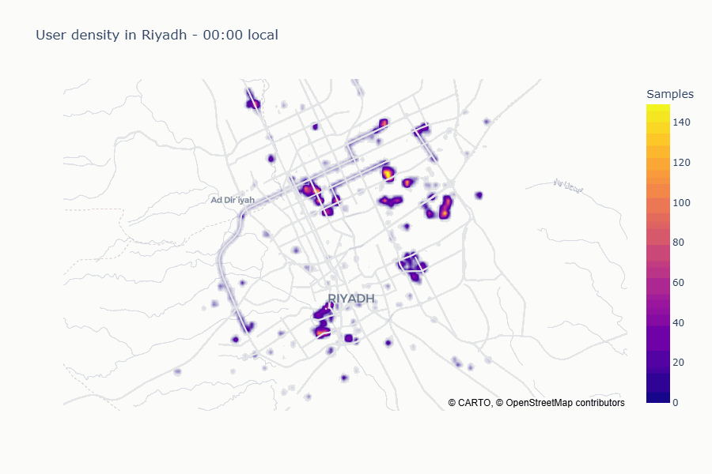
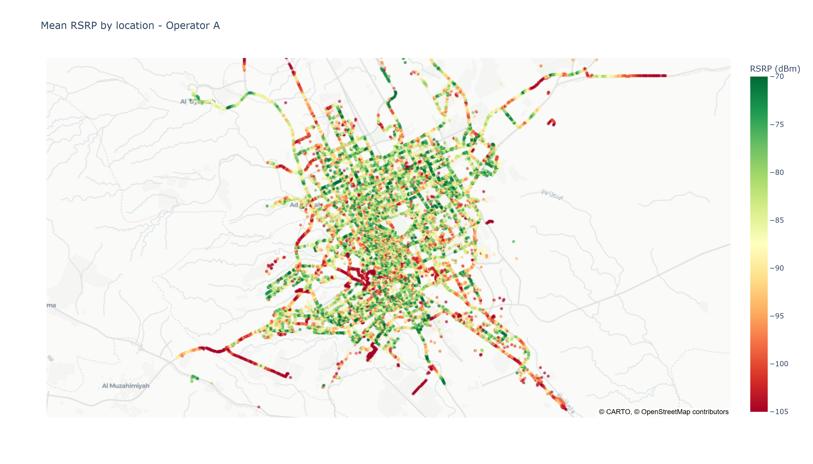
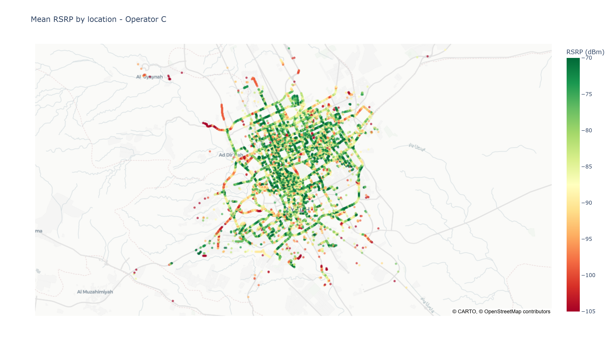
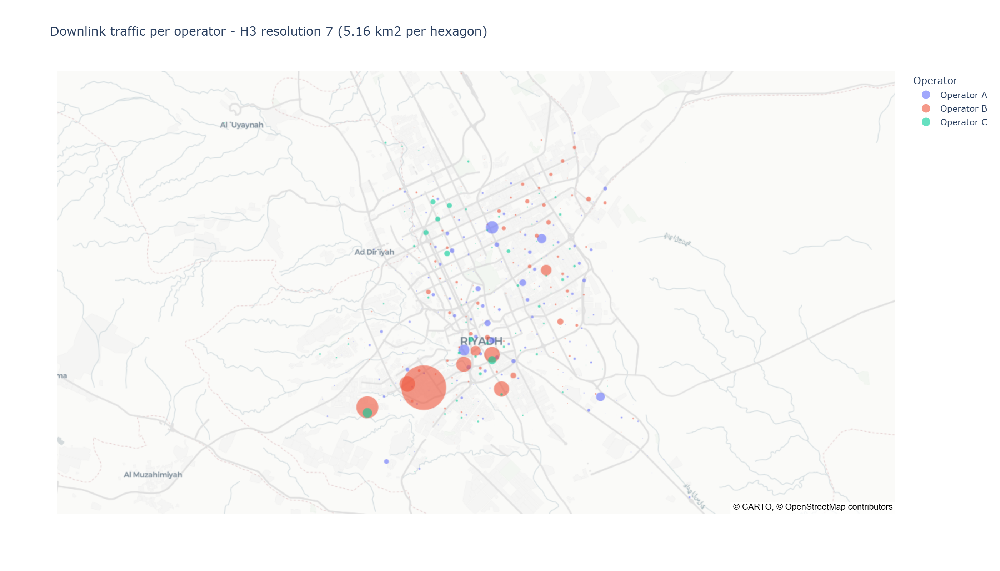
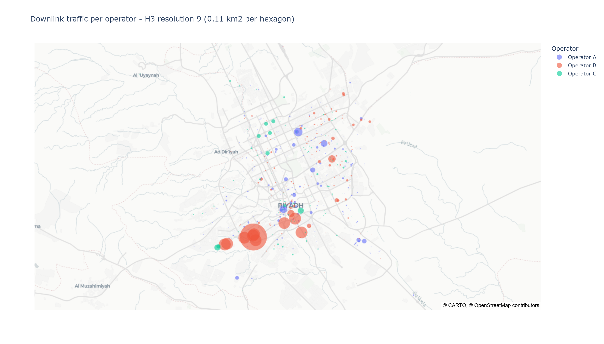
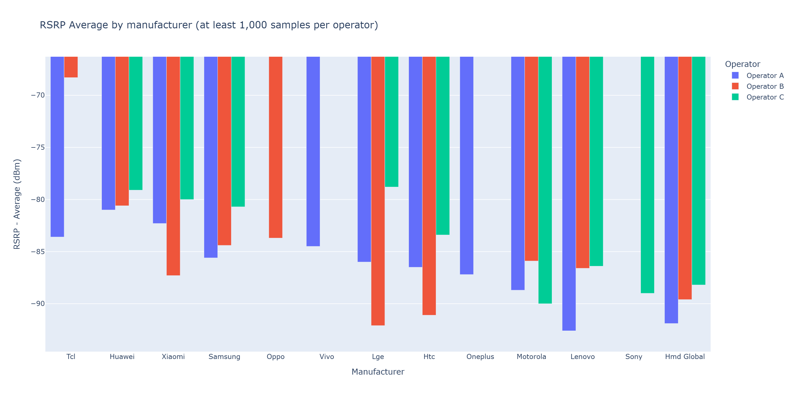
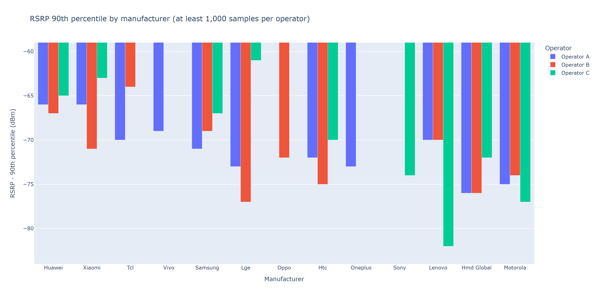

# 4G Network Performance Dashboard — Riyadh

**2 million crowdsourced signal measurements from real phones in Riyadh, turned into four interactive maps and charts that rank three mobile operators against each other.**

Which operator has the best coverage? Which one carries the most data, and where? Do certain handsets genuinely report worse signal? This project cleans two raw KPI datasets — **RSRP** (coverage, dBm) and **Traffic Volume** (data consumed, MB) — and builds an animated density time-lapse, an operator coverage map, an H3 hex-bin traffic hotspot map, and a device-vs-operator comparison, then reads the answers off them.

Short version of what the data says: the operator with the **weakest** coverage serves **more than half** the users, **10 hexagons out of 470** carry **60 %** of the city's downlink, and one handset brand is **89 %** of every sample — which changes how the rest of the charts should be read.

> **Data availability:** the datasets belong to **Ericsson** and are not mine to share, so `RSRP.csv` and `TrafficVolume.csv` are **not included** in this repository. The notebooks, cleaning logic, charts and findings are all here and fully documented; the outputs below were rendered from the real data.

Data visualization task for the Sultan Hussien Innovation Center AI challenge (Problem 1, §3.1).

---

## Contents

```
├─ notebooks/
│  ├─ RSRP_EDA.ipynb             cleaning + EDA of RSRP.csv        → rsrp_clean.parquet
│  ├─ Traffic_Volume_EDA.ipynb   cleaning + EDA of TrafficVolume.csv → traffic_clean.parquet
│  └─ Dashboard.ipynb            the 4 required charts + findings
├─ scripts/
│  ├─ make_timelapse.py          renders Chart 1 to docs/timelapse.gif
│  └─ make_screenshots.py        renders Charts 2–4 to docs/*.png
└─ docs/                         the rendered images used in this README
```

Run the notebooks in order: `RSRP_EDA` → `Traffic_Volume_EDA` → `Dashboard`.

## Setup

```bash
pip install pandas pyarrow plotly ipywidgets h3 kaleido pillow
```

The source CSVs are not distributed (see above). To run this end to end, put your own `RSRP.csv` and `TrafficVolume.csv` in the project root — the notebooks read them from there, and write the cleaned Parquet files back to the same place.

The two scripts are run from the project root:

```bash
python scripts/make_timelapse.py
python scripts/make_screenshots.py
```

---

## Data cleaning

**RSRP** (`RSRP.csv` → 1.98 M rows)

- Drop exact duplicates and the constant `Country` column
- Keep `RadioNetworkGeneration == 4G` and `RadioConnectionType == Mobile` — WiFi/Unknown says nothing about cellular coverage
- Keep RSRP within the valid **−140 … −40 dBm** range
- Parse `Timestamp` with `utc=True` (mixed offsets in the raw strings), then convert to `Asia/Riyadh` so `Hour` means *local* hour
- Lower-case `DeviceManufacturer` (`Lenovo` / `LENOVO` / `lenovo` were splitting into separate groups)
- De-duplicate on `Timestamp + lat + lon + operator + manufacturer` — the same physical sample is logged once per commercial `DeviceName`
- Add `RSRP_Quality` bands: Excellent ≥ −80, Good ≥ −90, Fair ≥ −100, Poor ≥ −110, Very Poor below

**Traffic Volume** (`TrafficVolume.csv` → 129.8 k rows)

- Same duplicate/`Country`/`Mobile`/timezone treatment
- **All radio generations kept** — 2G/3G is ~25 % of this file, and dropping it would understate every operator's real traffic
- `TrafficDirection` is part of the de-dup key, otherwise each `Uplink` row pairing a `Downlink` row is deleted
- Outliers kept — the bubble map sums traffic per area, and a genuinely huge session *is* the hotspot the chart should show

Both outputs are written to Parquet, which preserves dtypes and the timezone and reloads far faster than CSV.

**Coverage:** 2019-11-01 21:15 → 2019-11-04 23:59 local — a little over three days, not the full week the brief mentions.

---

## The dashboard

### 1. Hourly time-lapse of user density

Density map animated over local hour of day. The 2 M raw points are snapped to a ~110 m grid (3-decimal rounding) and counted per hour — ~5 k points per frame instead of 2 M. Colour range capped at the 99th percentile so a few very hot cells don't flatten every frame.



### 2. Coverage map per operator

Mean RSRP per grid cell for the operator picked from a dropdown. Cells with fewer than 3 samples are dropped (a single reading is noise). The colour range is **hard-coded to −105 … −70 dBm**, not auto-scaled — otherwise every operator looks equally green and the dropdown compares nothing.

| Operator A | Operator C |
|---|---|
|  |  |

### 3. Downlink traffic hotspots per operator

Riyadh is cut into H3 hexagons, downlink traffic is summed per hexagon per operator, and each hexagon is drawn as a bubble sized by that total. The slider changes H3 resolution (6 ≈ 36 km², 9 ≈ 0.1 km²). Each operator is nudged a fraction of a hexagon radius off the shared centre so bubbles don't occlude each other — cosmetic only, the binning is untouched.

| Resolution 7 (~5 km² per hexagon) | Resolution 9 (~0.1 km² per hexagon) |
|---|---|
|  |  |

### 4. RSRP per device manufacturer per operator

Grouped bars, one group per manufacturer and one bar per operator. Dropdown picks the aggregation (Average / Minimum / Maximum / 90th percentile); slider sets the minimum samples a manufacturer needs on an operator to appear.

The y-axis range is derived from the selected metric, not hard-coded — a fixed window breaks `Minimum` (bottoms out at the −140 dBm cleaning floor) and `Maximum` (reaches −44 dBm). Manufacturers are sorted by the selected metric.

> The data has no user identifier, so *number of users* is approximated by **number of samples**.

| Average | 90th percentile |
|---|---|
|  |  |

> The dropdowns and sliders need a running kernel — open `Dashboard.ipynb` and run it. A static render of the `.ipynb` shows the last drawn figure only.

---

## Findings

> Reading the numbers: RSRP is measured in **dBm** and is always negative — **closer to zero means better signal**. Around −80 is good, −110 is poor.

### The three operators at a glance

| | Operator A | Operator B | Operator C |
|---|---|---|---|
| Coverage quality | Worst | Middle | **Best** |
| Share of users | **55 %** | 23 % | 23 % |
| Share of downloaded data | 24 % | **65 %** | 11 % |
| Measurements with poor signal | 17 % | 9 % | **5 %** |

**1. The operator with the worst coverage serves the most people.**
C has clearly the best signal, A the worst — and the gap is widest exactly where it hurts, in the weakest locations. Yet A carries more than half of all measurements, more than B and C combined. A's coverage problem is the one affecting the most people.

**2. B sells data, A sells connections.**
B carries about **two thirds of all downloaded data from under a third of the measurements** — roughly six times more data per user than A. A is the mirror image: many users, little data. So **B's risk is congestion, A's risk is that its users can't use the data they pay for.**

**3. Almost all the traffic comes from a handful of places.**
Split the city into ~5 km² tiles and **10 tiles out of 470 carry 60 % of all downloaded data**. For a network planner that's the whole story — upgrading those ten spots beats spending evenly across the map. One caveat: the single biggest tile belongs almost entirely to one operator, so lopsidedly that it's more likely one very heavy user than a real difference in demand.

**4. The city is busiest in the late afternoon, not the morning.**
Activity is about **6× higher at its 16:00 peak than at its 04:00 low**, and stays high from late afternoon until well past 22:00. That's a Riyadh evening-social rhythm, not the twin commuter spikes of a European city — so capacity should be planned around the late afternoon.

**5. Some phone brands really do report worse signal — but ignore the rare ones.**
**Samsung is ~90 % of all measurements**, so its average *is* the network average, and every other brand is really being compared against Samsung. Among brands with enough data, **HMD Global (Nokia), Sony and Lenovo sit consistently below Samsung** — same network, same city, same days, so this is a handset gap worth flagging to a support team. Brands with only a few thousand measurements swing wildly and mean nothing; that's exactly what the minimum-samples slider is for.

---

## Notes and limitations

- Crowdsourced data — sample density reflects where the app's users are, not where the population is.
- No user identifier, so "users" is approximated by sample count throughout.
- ~3 days of data, not the full week stated in the brief.
